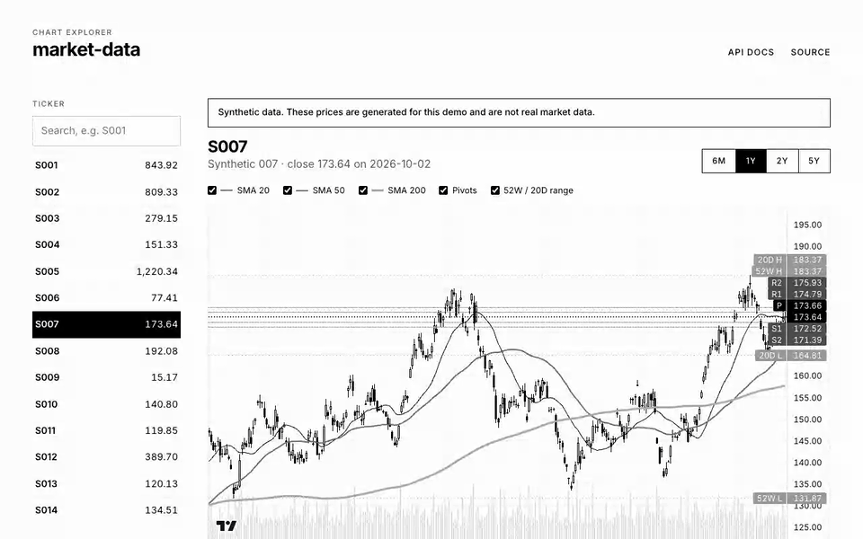
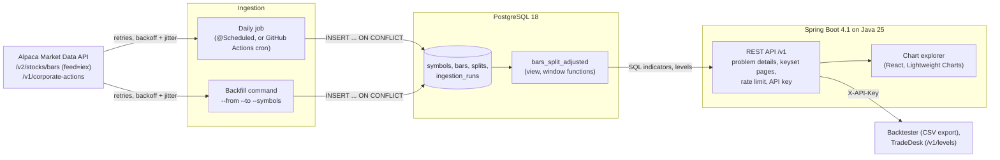

# market-data

[](https://github.com/lokaz-c/market-data/actions/workflows/ci.yml)

A Java service that pulls daily US equity bars from Alpaca's Market Data API into PostgreSQL. It computes
technical indicators and price levels in SQL with window functions, and serves them through a REST API and a
chart explorer.

It is meant to be the single source of market data for my backtesting simulator
([quant](https://github.com/lokaz-c/quant)) and my trading-desk assistant
([cf_ai_tradedesk](https://github.com/lokaz-c/cf_ai_tradedesk)), which cites `/v1/levels`. It is also where my
Java and SQL work is visible: plain SQL through Spring's `JdbcClient`, no ORM.

**Status:** not deployed yet. Public endpoints serve synthetic data until Alpaca gives written consent for public
display (see [Data source and terms](#data-source-and-terms)).



*Chart explorer, recorded locally against `docker compose up` with synthetic data (symbols S001-S050 are generated,
not real).*

## Architecture



## Run it

```bash
docker compose up --build        # or: make up
```

Open http://localhost:8080 for the chart explorer and http://localhost:8080/docs for the OpenAPI UI. Without Alpaca
keys the app generates synthetic demo data at startup: 50 symbols x 10 years. With keys in `.env`
(copy `.env.example`), ingest real bars with:

```bash
make backfill FROM=2016-01-01 SYMBOLS=AAPL,MSFT,SPY
```

For development: `DEMO_SEED=when-no-keys ./mvnw spring-boot:test-run` starts the API with demo data against a
throwaway Testcontainers PostgreSQL. Then
run `npm run dev` in `web/`, which proxies `/v1` to it. Run tests with `make test`, which needs Docker for
Testcontainers.

## API

| Endpoint | What it returns |
|---|---|
| `GET /v1/symbols?q=AA&limit=50` | Symbols that have data, with first/last bar and last close; prefix search |
| `GET /v1/bars/{ticker}?from=&to=&after=&limit=&adjustment=split\|raw` | Daily bars, split-adjusted by default |
| `GET /v1/indicators/{ticker}?from=&to=&after=&limit=` | Per day: SMA 20/50/200, 20-day volatility, ATR 14, 52-week high/low, pivot, R1, S1 |
| `GET /v1/levels/{ticker}?asOf=` | Pivots (P, R1-R3, S1-S3) from the last session, 20/50-day highs/lows, 52-week range |
| `GET /v1/export/bars.csv?symbols=&from=&to=` | Streaming CSV for up to 100 symbols; needs `X-API-Key` |
| `GET /actuator/health/{liveness,readiness}` | Liveness (no database) for the host; readiness (startup done, database up) for the UI |

```bash
curl -s 'localhost:8080/v1/levels/S001'
curl -s 'localhost:8080/v1/bars/S001?from=2026-01-02&to=2026-03-31&limit=2'   # follow nextAfter for the next page
curl -s 'localhost:8080/v1/bars/NOPE'   # 404, application/problem+json
```

- **Errors** are RFC 9457 problem details. Validation errors name the parameter that failed.
- **Pagination** is keyset on the bar date. A page returns `nextAfter`, and the next request starts the day after
  it. Each page is one range scan of the `(symbol_id, ts)` primary key, whatever its depth. OFFSET would read and
  discard every earlier row, and rows inserted by the daily job would shift pages under a client.
- **Rate limiting:** public `/v1` requests get a token bucket per client IP, with a burst of 30 and then 60 per
  minute. Over the limit: 429 with `Retry-After`. Requests with a valid API key are not limited.
- **API keys:** the service stores only SHA-256 digests (`API_KEY_SHA256`) and compares them in constant time. A
  key unlocks bulk export and non-public data sources.

## The SQL

All statements are in [`src/main/resources/sql`](src/main/resources/sql) and the schema is in the
[Flyway migrations](src/main/resources/db/migration). The service loads them from these files so they can be read
and run with `EXPLAIN` exactly as they execute.

### Idempotent ingestion

```sql
INSERT INTO bars AS b (...) VALUES (...)
ON CONFLICT (symbol_id, ts) DO UPDATE SET open = excluded.open, ...
WHERE (b.open, b.high, b.low, b.close, b.volume, ...) IS DISTINCT FROM (excluded.open, ...)
```

Re-running any range converges on the same rows. Unchanged rows are not rewritten, so a repeat run reports
0 rows upserted and leaves no dead tuples. Each run is logged in `ingestion_runs` with counts, retries and errors.
Alpaca calls retry 429, 5xx and I/O errors with exponential backoff and full jitter, and wait for
`X-RateLimit-Reset` on a 429.

### Split adjustment

The `bars_split_adjusted` view turns `splits` into date ranges with `LAG(ex_date)`. A cumulative factor for "this
split and every later one" is computed with a window ordered by `ex_date DESC`. Old and new share counts are kept
separately and multiplied with a custom `product(numeric)` aggregate. So a 3-for-2 followed by a 2-for-3 cancels to
exactly 1; `exp(sum(ln(x)))` would give 0.99999...

`SplitAdjustedViewIT` checks the view against Alpaca-shaped `adjustment=split` fixtures for AAPL's 4-for-1 and
TSLA's 5-for-1 and 3-for-1 splits.

### Indicators

All indicators use window functions over split-adjusted prices.

| Indicator | Definition |
|---|---|
| SMA 20/50/200 | `avg(close)` over a `ROWS` frame; NULL until the window is full |
| Volatility 20 | `stddev_samp(ln(close / lag(close)))` over 20 rows, times sqrt(252) |
| ATR 14 | Simple 14-day mean of true range `greatest(high - low, abs(high - lag(close)), abs(low - lag(close)))`; Wilder's recursive smoothing is not used |
| 52-week high/low | `max(high)` / `min(low)` over `RANGE BETWEEN INTERVAL '52 weeks' PRECEDING AND CURRENT ROW`: calendar time, so holidays do not stretch it |
| Pivots | Classic floor pivots from the previous session: P = (H + L + C) / 3, R1 = 2P - L, S1 = 2P - H, R2 = P + (H - L), S2 = P - (H - L), R3 = H + 2(P - L), S3 = L - 2(H - P) |

Indicator pages start their window 400 calendar days before the page, so SMA 200 on page 5 still has its history.
`IndicatorsIT` checks every value against a plain-Java reference and hand-computed pivots.

## Measured performance

These are local runs on synthetic data on an Apple M1 Pro (16 GiB, macOS 26.4) with Docker Desktop (8 CPUs,
15.6 GiB). They are not production measurements.

### Indexes

From [`make explain`](scripts/explain.py), written to [docs/explain.md](docs/explain.md). The dataset is 500
synthetic symbols x 10 years: 1,305,000 bars, 126 MB of heap, inserted date by date like a daily job. Times are the
median of 7 warm runs of the service's own SQL.

| Query | No index | Primary key `(symbol_id, ts)` | PK + `CLUSTER` |
|---|---:|---:|---:|
| Bars page, 1 year | 47.06 ms | 1.27 ms | 0.59 ms |
| Indicators page, 1 year | 60.93 ms | 14.87 ms | 13.81 ms |
| Levels | 204.69 ms | 1.41 ms | 0.76 ms |
| Symbol list with first/last bar (`LATERAL`) | 2,737.50 ms | 0.54 ms | 0.57 ms |

What the plans showed:

- **The levels query read the whole symbol.** The first version joined its date bounds from a CTE, so they became
  a filter applied after reading all 2,610 bars of the symbol. Turning them into scalar subqueries made them index
  conditions: 9.93 ms became 1.41 ms with the primary key (2,632 buffers became 276). Both versions are in the
  report.
- **Indicators are bound by CPU, not I/O.** With the index, the indicators query reads 553 buffers, but most of its
  15 ms is spent in `WindowAgg`. The 52-week `max`/`min` is about half of that: PostgreSQL recomputes `max`/`min`
  for every row of a moving frame because they have no inverse transition function.
- **Physical order matters.** A daily job writes rows date by date, so one symbol's bars are scattered across the
  heap: a one-year bars page touches 269 buffers. After `CLUSTER bars USING bars_pkey` it touches 11 and runs twice
  as fast. But CLUSTER takes an exclusive lock and is not maintained for new rows, so it is a periodic maintenance
  step, not a schema change.

### Load test

From [`make loadtest`](scripts/loadtest.sh) ([k6](loadtest/k6.js), written to
[docs/loadtest.md](docs/loadtest.md)). The test runs against the docker compose stack with the same 500 symbols:
- the app container is limited to 2 CPUs / 1 GB, and PostgreSQL to 2 CPUs / 2 GB
- per-IP rate limiting is off, because k6 sends everything from one IP
- the request mix is 40% bars, 30% indicators, 20% levels and 10% symbol search

| Scenario | Throughput | p50 | p95 | Errors | App CPU | DB CPU |
|---|---:|---:|---:|---:|---:|---:|
| Fixed 200 requests/s for 60 s | 200 req/s | 3.63 ms | 19.5 ms | 0.00% | 42% | 93% |
| 32 clients, no think time, 60 s | 366 req/s | 87.7 ms | 190.6 ms | 0.00% | 73% | 200% |

At saturation PostgreSQL sits at its 2-CPU limit while the app uses about a third of its own. Given the plans
above, the next step for throughput is caching indicator results, which change once a day, rather than anything in
the Java tier.

### Cold start on a free-tier-sized container

From [`make coldstart`](scripts/coldstart.sh), written to [docs/coldstart.md](docs/coldstart.md). The image runs
in a container limited to 0.1 CPU and 512 MB, the size of Render's free instance, against an already migrated
database. Two runs per variant:

| JVM settings | Ready after (run 1, run 2) |
|---|---:|
| Default JIT, no AOT cache | 301.0 s, 401.9 s |
| Default JIT, AOT cache | 258.2 s, 131.2 s |
| C1-only JIT (`-XX:TieredStopAtLevel=1`), no AOT cache | 125.8 s, 68.6 s |
| C1-only JIT + AOT cache (the `deploy/render.yaml` settings) | 103.8 s, 87.7 s |

- **Limiting the JIT to C1 is the large, consistent effect.** At 0.1 CPU, the C2 compiler threads compete with
  start-up for the CPU quota.
- **The AOT cache is a clear win only when CPU is not the limit.** Unconstrained, it halves start-up (3.5 s to
  1.9 s). At 0.1 CPU its effect is within the spread of these two runs.
- **Trade-off.** C1-only gives up some peak throughput; on a 0.1 CPU instance, start-up time matters more. Expect
  one to two minutes of JVM start on top of Render's own spin-up, which Render's docs put at about a minute.

## Tests

`./mvnw verify` runs 48 unit tests and 44 integration tests. The integration tests run against a real PostgreSQL 18
(Testcontainers), with WireMock standing in for Alpaca. One case is skipped until real Alpaca recordings exist (see
TODO below). `web/` has 16 Vitest tests. CI runs everything, plus lint, typecheck and a production build, on every
push and pull request.

| Area | What is tested |
|---|---|
| Ingestion (`IngestionServiceIT`) | Running twice gives the same rows and 0 upserts; an upstream correction updates 1 row; invalid bars are skipped and counted; 429 retried and logged; persistent 5xx logged as a failed run; pages written before a failure are kept; future splits ignored |
| Alpaca client (`AlpacaClientTest`, `RetrierTest`) | Query parameters and keys; `next_page_token` pagination with an encoded token; symbol chunking; New York session dates in summer and winter; waiting for `X-RateLimit-Reset`; giving up; no retry on 403; full-jitter bounds |
| SQL (`SplitAdjustedViewIT`, `IndicatorsIT`, `SchemaIT`) | View vs Alpaca-shaped split-adjusted fixtures; compounding, reverse and offsetting splits; every indicator vs a Java reference; hand-computed pivots; CHECK constraints |
| API (`BarsApiIT`, `ExportIT`, `RateLimitFilterTest`, `OpenApiIT`) | Keyset pages cover a range once and in order; problem-detail bodies; parameter validation; synthetic vs Alpaca visibility with and without a key; CSV export; 429 with `Retry-After` |
| Synthetic data (`SyntheticDataIT`) | Expected row count, all rows labelled synthetic, same seed gives same data, no jump in the adjusted series at synthetic splits |

## Why these technologies

- **Java 25 and Spring Boot 4.1.** Java 25 is the current LTS; Boot 4.1.1 was the current release, generated from
  start.spring.io. Records hold the DTOs and configuration, constructors do the injection, and virtual threads
  serve requests: since Java 24, blocking JDBC calls inside `synchronized` no longer pin carrier threads (JEP 491).
- **PostgreSQL 18 with hand-written SQL through `JdbcClient`, no JPA.** The interesting work here is SQL: window
  frames (`ROWS` vs `RANGE`), `LATERAL`, `ON CONFLICT`, a custom aggregate. An ORM would hide exactly that. 18 is
  the current major version.
- **Flyway.** Versioned, reviewable schema changes that run on startup and in every test.
- **Testcontainers.** Window functions, `ON CONFLICT ... WHERE`, `RANGE` frames with intervals and custom
  aggregates need a real PostgreSQL. An in-memory stand-in would test a different database.
- **WireMock.** Lets tests replay Alpaca's documented JSON, including 429s, 5xx and pagination, without keys or
  network access.
- **Bucket4j with Caffeine.** Bucket4j implements the token bucket (refill, burst, time to next token). Caffeine
  bounds the per-IP buckets by size and idle time. In-process state is right for one instance, and Bucket4j can
  move to a shared store if that changes.
- **springdoc-openapi 3.1.** OpenAPI and Swagger UI generated from the controllers; 3.1 is the line built for
  Boot 4.1.
- **React, Vite and TradingView Lightweight Charts 5.** A small, fast chart library made for OHLC data. The UI is
  built into the same Docker image, so there is one thing to deploy.
- **k6.** Scriptable load tests with open (fixed-rate) and closed (fixed-clients) models and percentile output.
- **Not used:** Redis, Kafka and gRPC. One instance, one database and a daily batch don't need a cache tier, a log
  or a binary protocol yet. The load test points at caching indicators first, which an in-process cache would
  cover. A gRPC export benchmarked against the CSV endpoint is a possible next step; it is not built.

## Data source and terms

I checked these against Alpaca's documentation and legal pages in October 2026.

- **Endpoints.** Daily bars come from `GET https://data.alpaca.markets/v2/stocks/bars` with `timeframe=1Day`,
  `adjustment=raw`, `feed=iex`, paginated by `next_page_token`
  ([reference](https://docs.alpaca.markets/reference/stockbars)). Splits come from `GET /v1/corporate-actions` with
  `types=forward_split,reverse_split` ([reference](https://docs.alpaca.markets/us/reference/corporateactions-1)).
  Alpaca's pricing page lists corporate actions as included in the free plan, which is why splits come from there
  rather than from comparing raw and split-adjusted bars.
- **Free ("Basic") plan.** 200 historical API calls per minute; real-time coverage is IEX only
  ([About Market Data](https://docs.alpaca.markets/docs/about-market-data-api)). A paper-only account is "only
  entitled to receive and make use of IEX market data" ([paper trading](https://docs.alpaca.markets/us/docs/paper-trading)),
  so the service always sends `feed=iex`. The client honours `X-RateLimit-Reset` on 429s.
- **IEX coverage.** IEX is a single exchange, about 2.5% of US volume
  ([historical data](https://docs.alpaca.markets/us/docs/historical-stock-data-1)). IEX volumes and OHLC are not
  the consolidated tape.
- **Redistribution.** Alpaca's [Terms and Conditions](https://files.alpaca.markets/disclosures/library/TermsAndConditions.pdf)
  say Content is "provided exclusively for personal and noncommercial access and use" and may not be "publicly
  displayed ... without Alpaca's express prior written consent". Making it available to others through an
  application requires 30 days' written notice.
- **How the service complies.** Without an API key, the public endpoints only serve sources listed in
  `PUBLIC_DATA_SOURCES`, which defaults to `synthetic`. Alpaca-sourced symbols return the same 404 as unknown ones.
  Public responses are limited to what the chart needs (at most 1,000 rows per page) and are rate-limited. Bulk
  export needs a key. If Alpaca gives consent, set `PUBLIC_DATA_SOURCES=alpaca,synthetic` and add the IEX
  attribution IEX's policy asks for.

The chart library's licence requires the attribution in the page footer: "TradingView Lightweight Charts™,
Copyright (c) 2025 TradingView, Inc., https://www.tradingview.com/".

## Deploy (not active)

The recommended free setup is a Render free web service plus Neon free PostgreSQL. Both are free with no credit card
and no expiry, Neon offers PostgreSQL 17 and 18, and Render builds the Dockerfile from GitHub.
[`deploy/render.yaml`](deploy/render.yaml) describes the service. It does nothing until a Blueprint is created from
it in the Render dashboard.

Steps:

1. **Neon.** Create a project at https://console.neon.tech: PostgreSQL 18, region AWS us-west-2 (Oregon). From
   "Connect", copy the direct (non-pooler) host and split the connection string into:
   - `SPRING_DATASOURCE_URL=jdbc:postgresql://<host>/neondb?sslmode=require`
   - `SPRING_DATASOURCE_USERNAME`
   - `SPRING_DATASOURCE_PASSWORD`
2. **Render.** Sign up at https://dashboard.render.com with GitHub, then New > Blueprint > this repository, with
   Blueprint path `deploy/render.yaml`. Enter the three database values when prompted. Leave `API_KEY_SHA256` empty,
   or set the digest of a key for TradeDesk and the backtester.
3. **Ingestion (once Alpaca keys exist).** Add the repository secrets `ALPACA_API_KEY_ID`, `ALPACA_API_SECRET_KEY`
   and the three `SPRING_DATASOURCE_*` values. Set the repository variable `INGEST_ENABLED=true` (and optionally
   `INGEST_SYMBOLS`). [`ingest.yml`](.github/workflows/ingest.yml) then runs the daily ingestion against Neon after
   each session. Run it once by hand with an early `from` date to backfill.

Free-tier behaviour to expect:
- Render stops the service after 15 minutes without traffic and shows its own loading page while it restarts. The
  chart explorer's "server waking up" screen covers a tab left open across that.
- Neon suspends after 5 minutes idle and resumes in a few hundred milliseconds.
- Render's health check uses liveness, which never touches the database, so it does not keep Neon awake.

## Limitations

- **Not deployed yet.** Everything above runs locally; the deploy steps need accounts I have not created.
- **Synthetic data in public.** No Alpaca keys exist yet. When they do, Alpaca data still stays behind the API key
  until Alpaca gives written consent for public display.
- **IEX only.** About 2.5% of US volume. Volumes and some OHLC values differ from consolidated data.
- **Splits only.** Prices are adjusted for splits, not dividends or spin-offs.
- **Indicator choices.** ATR uses a simple mean rather than Wilder's smoothing. Pivots are classic floor pivots only.
- **Synthetic calendar.** Synthetic data has every weekday as a session; there is no holiday calendar.
- **One instance.** The rate limiter keeps state in memory, which is correct for one instance only.
- **Cold starts.** A 0.1 CPU free instance needs one to two minutes for the JVM to start, measured locally (see
  above), plus the host's spin-up.
- **Local measurements.** Performance numbers come from a laptop with synthetic data, with client and server on the
  same machine.
- **Fixtures.** The split-adjustment fixtures are hand-built until real Alpaca responses are recorded.

## TODO(lorenzo)

- Create an Alpaca paper account and keys, then run `scripts/record-fixtures.sh` and commit the recorded fixtures.
- Ask Alpaca for written consent before showing Alpaca data publicly.
- Create the Neon and Render accounts and follow [Deploy](#deploy-not-active).

## Licence

MIT, see [LICENSE](LICENSE). TradingView Lightweight Charts is Apache-2.0, with the attribution above.
